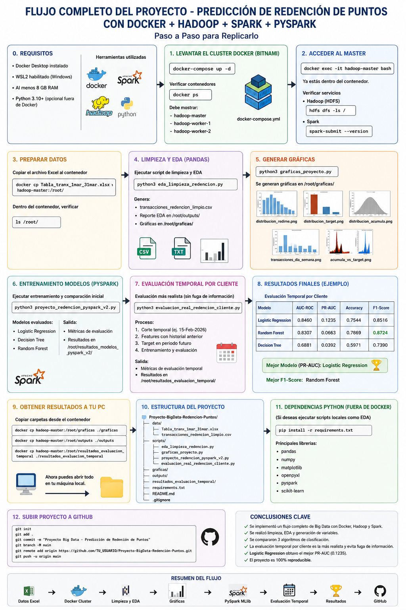

# Predicción de Redención de Puntos en un Programa de Lealtad

## Descripción

Proyecto académico de Big Data enfocado en la predicción de redención de puntos mediante técnicas de Machine Learning utilizando PySpark MLlib en entorno Docker con Hadoop.

El objetivo es identificar clientes con probabilidad de redimir puntos en el futuro utilizando información histórica de transacciones.

---

## Tecnologías Utilizadas

* Python 3
* PySpark MLlib
* Hadoop
* Docker
* Pandas
* Matplotlib
* Scikit-Learn

---

## Arquitectura Técnica

Dataset Excel

↓

EDA y Limpieza

↓

CSV Procesado

↓

PySpark MLlib

↓

Feature Engineering

↓

Logistic Regression

Decision Tree

Random Forest

↓

Evaluación de Modelos

↓

Predicción de Redención

---
## Flujo Completo del Proyecto

## Estructura del Proyecto

Proyecto-BigData-Redencion-Puntos/

├── data/

│ ├── Tabla_tranx_1mar_31mar.xlsx

│ └── transacciones_redencion_limpio.csv

│

├── scripts/

│ ├── eda_limpieza_redencion.py

│ ├── proyecto_redencion_pyspark.py

│ ├── proyecto_redencion_pyspark_v2.py

│ ├── evaluacion_real_redencion_cliente.py

│ └── graficas_proyecto.py

│

├── outputs/

│ ├── distribucion_redime.png

│ ├── distribucion_target.png

│ ├── distribucion_acumula.png

│ ├── transacciones_dia_semana.png

│ └── acumula_vs_target.png

│ └── reporte_eda.txt

│

├── resultados_evaluacion_temporal/

│

└── README.md

---

## Análisis Exploratorio (EDA)

El análisis exploratorio permitió identificar:

* Más de 165 mil transacciones.
* Fuerte desbalance de clases.
* Solo 474 redenciones reales.
* Variables con alta cantidad de valores nulos.
* Comportamiento temporal de las transacciones.

---

## Construcción del TARGET

TARGET = 1

Cliente realiza una redención futura.

TARGET = 0

Cliente no realiza una redención futura.

---

## Modelos Evaluados

### Logistic Regression

Modelo lineal utilizado como línea base para clasificación binaria.

### Decision Tree

Modelo basado en reglas de decisión para segmentación de clientes.

### Random Forest

Ensamble de múltiples árboles de decisión para mejorar capacidad predictiva.

---

## Evaluación Temporal

Se implementó una validación temporal para evitar fuga de información:

* Historial antes del 15-Feb-2026.
* Predicción de redenciones posteriores.

Este enfoque representa un escenario real de negocio.

---

## Resultados Finales

| Modelo              | AUC-ROC | PR-AUC | Accuracy | F1     |
| ------------------- | ------- | ------ | -------- | ------ |
| Logistic Regression | 0.8460  | 0.1235 | 0.7544   | 0.8516 |
| Random Forest       | 0.8307  | 0.0663 | 0.7869   | 0.8724 |
| Decision Tree       | 0.6881  | 0.0392 | 0.5971   | 0.7390 |

---

## Conclusiones

* Se detectó fuga de información en evaluaciones iniciales.
* Se implementó una validación temporal más robusta.
* Logistic Regression obtuvo el mejor AUC-ROC.
* Random Forest obtuvo el mejor F1-Score.
* El enfoque temporal proporciona resultados más cercanos a un entorno productivo.

---

## Autores
Cesar Bladimir Romero Rugamas
Walter Alexander Salguero Rodríguez
Guillermo Ulises Palacios Flores
Dataset Douglas Ibañez
